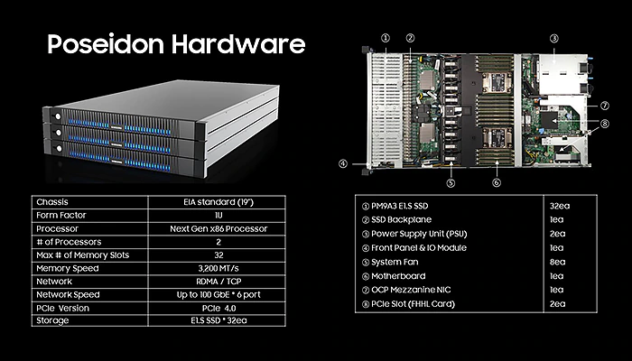
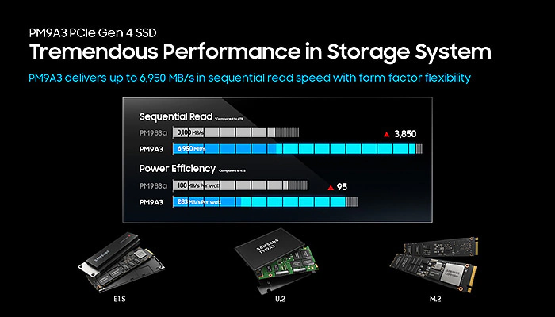

# The Poseidon Project

## Towards a More Open Future

For decades, data center manufacturers and consumers could rely on each new CPU generation delivering better performance, as well as a lower power envelope. CPUs still get smaller with each new generation of technology, but power efficiency and performance gains from lithography are smaller than they once were. Today, improving performance means less reliance on lithography and more emphasis on solving energy losses and bottlenecks within other parts of the system. Because the OCP touches every aspect of the data center, from server cooling and airflow to rack design and storage specifications, this kind of cross-industry collaboration is critical to sustaining the innovation that has driven performance improvements across the computing industry. To date, the OCP has benefited from the contributions of many companies. Samsung added its own expertise when it joined the OCP in 2015, and it helped organize global OCP conferences in 2020. Samsung is also especially involved in the OCP’s Korean organization.

On the hardware front, Samsung has also launched an open hardware Poseidon server, a disaggregated storage platform capable of meeting the needs of both the hyperscaler server manufacturers and the general data center market. The Poseidon server offers up to 2~3 times the storage capacity of traditional flash system, with support for 32 Samsung E1.S drives at 8TB each in 1U system(256TB).

One key building block of this new storage platform is Samsung’s PCIe Gen4 PM9A3 SSD. The PM9A3 SSD is designed to maximize performance per watt. It uses Samsung’s sixth-generation V-NAND memory and offers PCIe Gen4 support. The PM9A3 dramatically improves performance over the fifth-generation PM983a, with a sequential read speed of 6950MB/s. This indicates about twice as much improvement as its predecessor. Furthermore, the PM9A3 provides superior power efficiency at 283MB/s per watt for sequential writes, making it nearly 50% more energy efficient than PM983a’s 188MB/s per watt.

"Offering the most 1U server-optimized form-factor, the PM9A3 will improve space utilization, add PCIe Gen4 speeds, enable increased capacity and more," said Jongyoul Lee, Executive Vice President of Samsung’s Memory Software Development Team. "We see it eventually becoming the most sought-after storage solution on the market for leading cloud data center servers, and one of the more cost-effective."

## Poseidon hardware

The Poseidon OS (POS) included in Project Poseidon is also attracting attention. POS is a lightweight storage OS that offers improved performance and valuable features over the storage network. POS exploits the benefit of NVMe SSDs by optimizing the storage stack and leveraging the state-of-the-art high-speed interface. Also, it implements software-defined storage capabilities to meet the various needs of storage applications in a data center. With POS, industries can easily build composable disaggregated infrastructure in their data centers. The latest version of POS has been developed and tested with PCIe Gen4 interconnect, and was released on Github.

Collaboration and cooperation are the engine that will power the next decade of advances in system design and semiconductor technology. Over the past 15 years, data centers have become increasingly efficient worldwide, with the industry’s average PUE (Power Usage Effectiveness) ratio falling from 2.5 in 2007 to 1.67 in 2019. Higher values indicate less-efficient data centers. Even 1.67 is high compared to what’s become standard in certain industries. The OCP has been responsible for some of this industry-wide improvement by fostering better communication between server customers and manufacturers, as well as between the various industry partners themselves.

## Building Better, Together
The OCP’s approach prevents market fragmentation and reduces the cost of data center development and maintenance. It provides various stakeholders with their own advantages. From the SSD manufacturers’ point of view, the OCP offers a universal specification that meets the needs of multiple vendors. This reduces uncertainty in development schedules, improves resource utilization and streamlines the overall process.

The OCP’s NVMe Cloud SSD Specification was first issued by Facebook and Microsoft and is currently in development with input from server manufacturers like HPE and Dell EMC. Creating a collaborative standard reduces the chance that the specification will change either during development or mass production. Having this confidence about the uniformity of current generation SSDs also makes it possible to predict how the specifications will change in the next-generation product planning stage.

The outcomes are clear to see. The Facebook data center in Prineville, Oregon, which was a key driver in establishing the OCP, outperforms other data centers in power usage effectiveness. The aim is for all data centers to become more efficient and easier to build, with fewer incompatibility issues. Sharing ideas, specifications and intellectual property is key to making this happen.

Independent evaluations of the OCP point to its long-term success. Respected press outlets like The Next Platform have evaluated the state of the OCP and found evidence of long-term growth and rising popularity, writing: “Step by step, the OCP ecosystem keeps growing and improving on every key metric, and the base of customers and the amount of money that companies are spending on OCP iron – including servers, storage, switches, edge cell sites, and network interface cards – is also growing as a consequence.”

Samsung has quickly released SSDs that satisfy the OCP SSD specifications and has continued to work on OCP projects, along with Project Poseidon. Samsung’s rapid application and engagement have allowed the company to lead the market and develop technology that works for the greater good. It has opened the door to future collaboration alongside other major system builders to build better data centers for the future.