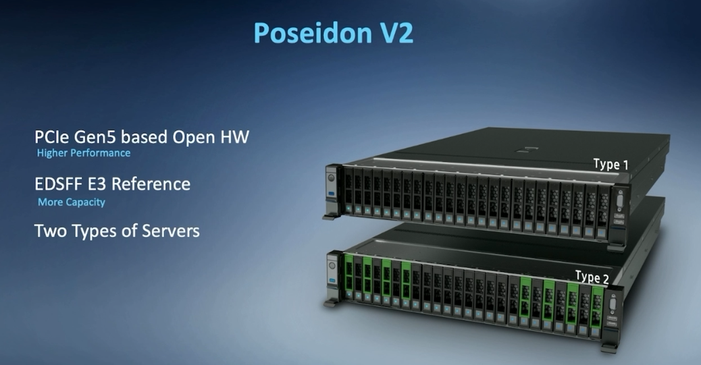
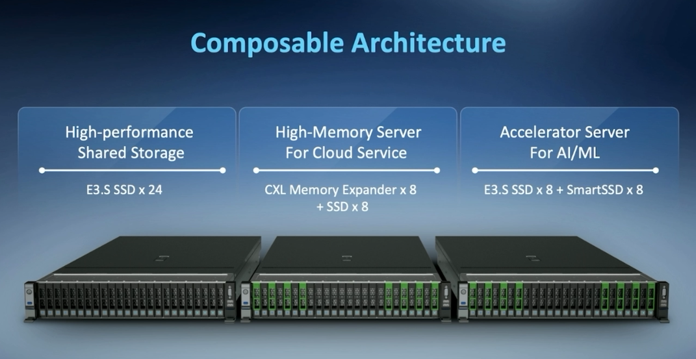
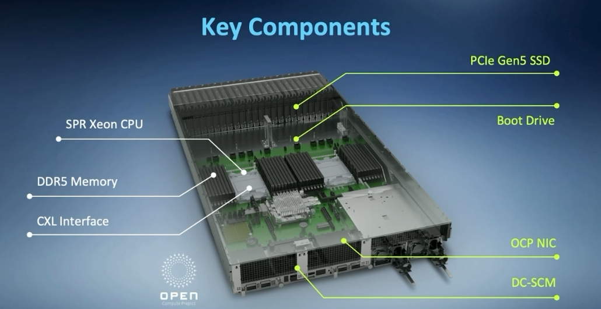

# Poseidon V2 E3.x Reference System

## Inspur and Samsung Jointly Announce Poseidon V2 System

During the annual OCP Global Summit in San Jose, Inspur and Samsung have announced the joint launch of the Poseidon V2 E3.x reference system. This server adopted composable architecture to maximize the benefits of the EDSFF E3.x form factor. Not only does the new Poseidon V2 support PCIe Gen5 SSDs, but also a range of other devices like AI/ML accelerators or CXL Memory Expanders. With this flexibility, organizations can configure the system according to their data center needs as this open standards server marches toward mainstream use cases.

Last year, Inspur unveiled the open all-flash storage resource pooling solution, which was also jointly developed alongside Samsung. This 1U server-based storage solution leveraged the EDSFF 1U Short (E1.S), which features the right blend of capacity and performance for servers and data centers. It supports two rows of flash drives for larger capacity and flash memory up to 256TB.

Those who are serious about future-proofing their server architecture should definitely start implementing E1.S in their data centers. The bigger your server environment and data footprint is, the more you will benefit from this new form factor due to the sheer thermal and density improvements. Inspur believes that the E1.S will revolutionize their products, which will thus greatly impact their customers.

Poseidon is an open-source storage project developed by a multi-industry collaboration (Inspur, Samsung, and Naver Cloud) capable of meeting the needs of both the hyperscaler server manufacturers and the general data center market. Inspur is responsible for developing some of the hardware, while Samsung took the role of creating the storage OS. After the hardware and software were integrated, it was provided to Naver Cloud to run tests and deploy. Poseidon has come a long way since version 1, as the first version of the storage OS was released on GitHub in April ’21 with regular updates since then.

Poseidon V2 is a new reference platform that leverages PCIe Gen5 and the E3 form factor. Compared to version 1, which used E1.S and the Gen4 interface, V2 is capable of achieving higher performance and can accommodate more density. It also offers two types of backplanes on the same server.

Component-wise, it features both open source and up-to-date technology, including an SPR Xeon CPU, DDR5 memory, CXL interface, Open Compute Project (OCP) NIC, and Datacenter-ready Secure Control Module (DC-SCM).

This allows Poseidon V2 to offer a range of different builds, including high-performance shared storage, high-memory servers for Cloud service, and accelerator servers for AI/ML, as seen in the figure below:

Inspur believes its customers can greatly benefit from the modular design offered in Poseidon V2. The technology shown at OCP is often many years ahead of broad adoption in the enterprise. Poseidon V2 feels a little more mature though and may pop up in the modern data center sooner thanks to the aggressive feature set and increased appetite for open standards.