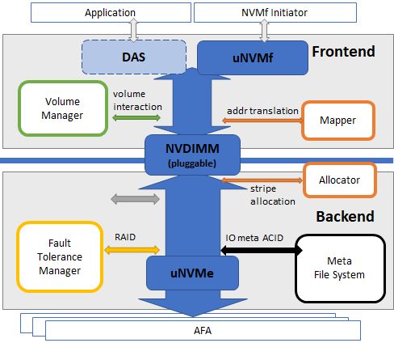
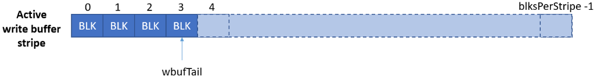
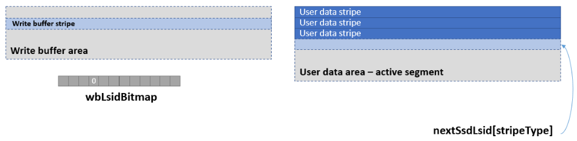
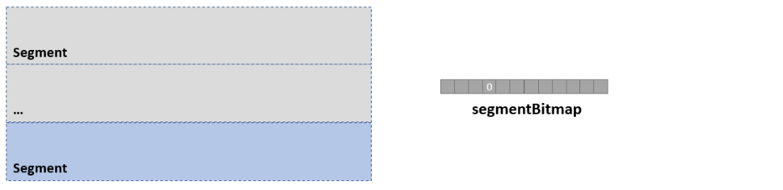

- [Introduction](#introduction)
- [Terminology](#terminology)
- [Level Mapping Scheme](#level-mapping-scheme)
- [Area](#area)

# Introduction

The Allocator module manages the persistent media provided by the POS system to process user data write requests.
Persistent media consists of segment-stripe-block hierarchy and provides logical user write space to external modules.
The Allocator manages both the used and unused space for each layer, and manages the validity of each space to implement log storage.

The main actors that rely on the Allocator are as follows, and commonly request the validity information and management of the storage area.

- I/O : User I/O and Flush command.
- Array : Before/after rebuild operation.
- GC : Before/after segment reclaim operation.
- JournalManager : After checkpoint, replay operation.

## Allocator Context

In order to divide the storage space into segment, stripe, and block and manage validity, a number of BitMap data structures are used in which one Bit expresses one unit object.

- Allocation Block :
It has an unallocated block, and there is one active stripe for each volume that allocates a block when requesting a block allocation.
One stripe is divided into a specific integer (N) block, and 1 to N are allocated upon request.
When a plurality of blocks are requested, only the number of blocks contained in a maximum of one strip at a time is allocated.

- Allocation Stripe :
The completed write buffer stripe is flushed to the user data region by the event handler.
Stripes in the user data region have a multiple types. The Active Segment allocates the userdata area's Stripe. If all of them are used, a new Active Segment is allocated.

- Allocation Segment : Segment is a unit of garbage collection operation. Userdata is divided into segments.
