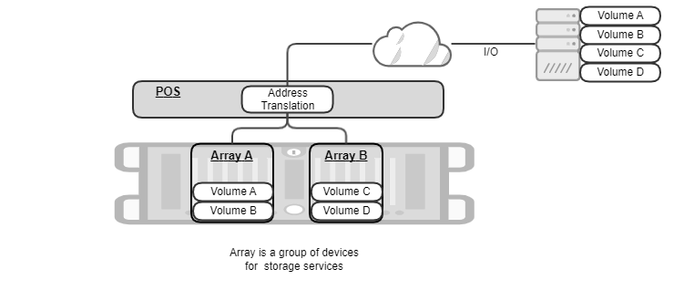
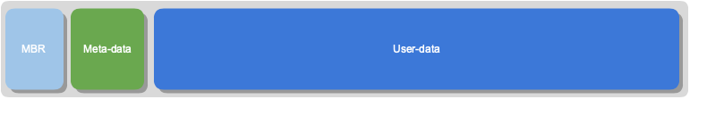
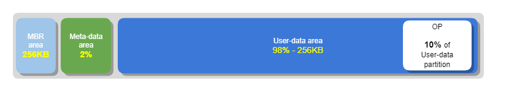
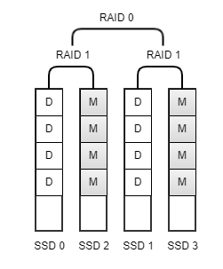
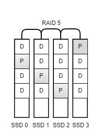
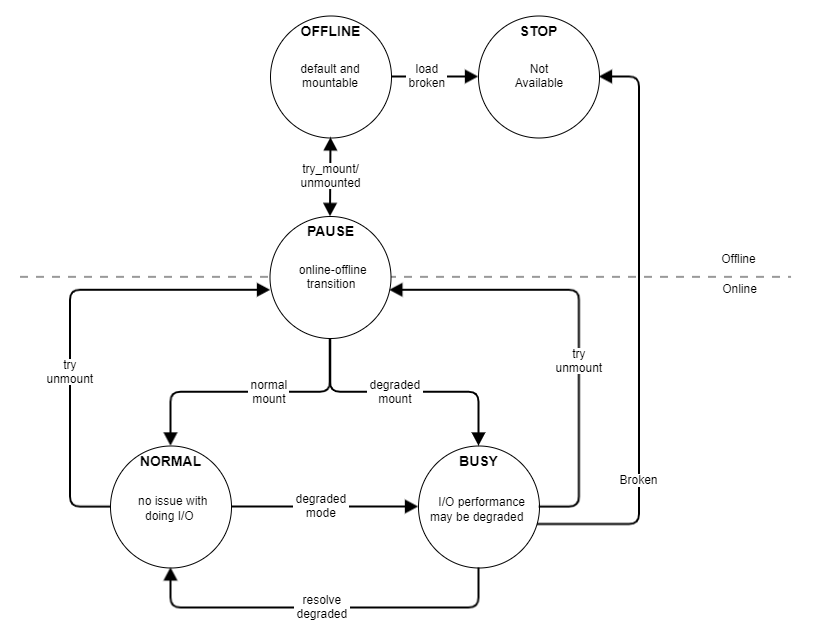

## Device and Array
POS internally manages various types of storage resources to support virtualization. Device and Array are essential building blocks to implement the feature. In this section, we will explore how they are abstracted out to support various storage use cases and what kinds of administrative knowledge is there to understand the internals of the POS system. 

### What Is POS Array?
POS array is a user-defined collection of physical storage devices and a basic unit to which storage administrator could issue commands such as status-check, create-volume, delete-volume, mount, or unmount. The same storage device cannot be owned by two different arrays. In this sense, you could think of POS array as a way to group a set of physical storage resources exclusively. 

POS array can contain 1 or more POS volumes, each of which can be exposed to initiator(s) as a block device. POS array enforces the same data protection policy across its volumes. 

In the following figure, POS manages two POS arrays, "A" and "B", each exposing two POS volumes. Initiator gets connected to all those 4 POS volumes over NVMe-oF, converts block requests from applications into NVMe-oF packets, and sends/receives them to/from POS volumes "A", "B", "C", and "D". POS is responsible for translating the destination address of initiator's request into a list of (SSD id, Logical Block Addresses).

### Creating POS Array
Storage administrator may want to manage multiple POS arrays to meet various Service-Level Agreement (SLA) requirements.  

- POS can have up to 8 arrays in total.
- Applications having strict performance SLA should run on a dedicated, isolated set of SSD devices, because they should not be interfered by the other applications.
- Certain application has strict durability SLA and needs to have higher redundancy than RAID 5. 
- The failure domain of one application needs to be isolated from that of other application. Even if certain POS array gets data loss due to bugs, multiple SSD failures, corruptions, and etc, the issue shouldn't propagate to other POS arrays. 
- The lifespans of SSDs should be spread out sufficiently such that we shouldn't have to replace all of them at the same time. Having separate arrays could isolate I/O workloads and effectively spread the lifespans compared to the case that a single array serves all workloads in a mixed fashion. 

To create a new array, the following information needs to be provided for POS:

- Array name: POS needs to be able to uniquely identify the target POS array. 
- Buffer device: POS accumulates writes in a sequential fashion in a given "buffer" device (normally, NVRAM) to improve write performance and latency.
- Data devices: POS stores both user data and metadata in "data" devices. POS internally maintains block mapping to make the best use of SSDs, e.g., by striping across data devices and chunking within a data device.
- Spare device(s): When POS detects a faulty device, it rebuilds missing data onto a spare device by calculating RAID parity. Spare devices can be dynamically attached/detached even when POS array is mounted.
- RAID type: POS protects user data with RAID. Currently only RAID5 is supported.

POS validates if user-supplied inputs are well-formed and complies with system constraints:

- The length of an array name can be up to 63 characters. The possible character is [a-zA-Z0-9_-].
- POS array must have exactly one buffer device by design.
- The minimum number of data devices is 3. This is required by RAID 5.
- The name of a buffer/data/spare must be picked up from SPDK runtime. Getting started describes what those names look like and how to retrieve them by using POS CLI. 
- The capacity of a buffer device must be equal to or larger than "(128 MB * # of data devices) + 512 MB". 
- The maximum number of data and spare devices in total is 32. 
- The capacity of a single NVMe SSD must be between 20 GB and 32 TB.

### Partition
POS introduces a logical storage resource called POS partition that internally provides multi-devices abstraction for other components. Every "data" device within an POS array is divided into three areas for different purposes. The collection of the same area from all "data" devices is defined as POS partition. Hence, POS array has three partitions, each of which spanning across all data devices. POS partition enables other software components to access multiple data devices in parallel without detailed knowledge about their physical layout. 

The types of POS partition are as follows:

- Master Boot Record (MBR) partition stores array configuration. If POS or underlying host gets restarted for any reason, POS would retrieve the previous array information from MBR partition and reconstruct its internal data structures in memory.
- Meta-data partition manages logical-to-physical mappings and write operations in the partition to support virtualization and consistency. 
- User-data partition stores actual user content transferred from initiator(s).

The following figure illustrates the layout of the partitions within POS array.

The layout of three areas within a data device looks exactly the same. We name them as MBR, metadata, and userdata "partition area" respectively. Here is how POS calculates the size of each partition area and the capacity of POS array:

- MBR partition area = 256 KB
- Metadata partition area = 2% * the raw size of a data device.
- Userdata partition area = the raw size of a data device - MBR partition area - metadata partition area
- Userdata partition area reserves 10% of its size for Over Provisioning area. 
- Effective userdata partition area = userdata partition area * 0.9
- The capacity of POS array = effective userdata partition area * (# of data devices - # of parity devices)

    

### RAID
POS implements data redundancy at POS partition level. Parity device in POS is defined as a device that contains device recovery information. 

- Metadata partition is protected by RAID 10. The metadata partition area is divided into multiple chunks, each of which being fully mirrored. Hence, the number of parity devices equals to 50% of the total number of data devices in POS array.

    

- Userdata partition is protected by RAID 5 as the default. The userdata partition area is divided into multiple chunks, each of which containing either data or parity bits. POS stores parity chunk in a round-robin fashion, so keeps one parity device effectively.

    

When POS detects a data device failure, it automatically enters "degraded" mode, which is a fallback mode that continues general array operations but with potential performance degradation caused by 1) decreased read parallelism and 2) resource contention due to RAID rebuild operation. 

POS conditionally initiates data construction procedure, called as "RAID rebuild", to replace a failed device with a new one. In degraded mode, POS checks periodically whether there is an available spare device and proceeds to rebuild if there is any. Otherwise, POS array will remain in degraded mode until a spare device is newly added. The RAID rebuild doesn't block user I/Os from being processed, although it may impact on the performance of user I/Os. Please note that RAID rebuild generates intense internal I/Os to copy blocks between spare and data devices. POS offers a CLI command called "perf_impact" for a storage administrator to be able to adjust the level of the intensity and find a balance between fast recovery and user's perf SLA. 

### State Transition Diagram
Upon internal/external events, POS may switch from one state to another and adjust its behavior. For example, if POS is in PAUSE state to recover from journals, it will block any user I/Os during the period. In this section, we will explain the states that POS could enter and what their implications are. 

#### Types of Array State
Array is always in one of POS states in the following table.

|State|Description|
|---|---|
|OFFLINE|POS array has been created or loaded, but not mounted yet. |
|STOP|POS array is running into an unusual situation that it cannot be corrected by itself. POS array becomes unavailable to avoid further data loss/corruption. For example, if the number of failed devices exceeds the level of fault tolerance (e.g., 2 failures in RAID 5-protected POS partition), a lost device cannot be restored.|
|NORMAL|POS array is operating normally and able to serve user I/Os without performance impact.|
|BUSY|POS array is handling both internal I/Os and user I/Os. The user I/O performance could be potentially degraded due to resource contention.|
|PAUSE|POS array is blocking user I/Os to change online - offline state.|

#### Types of Situation
Situation indicates the detailed explanation of POS array state. Situation is always mapped to a single state, while State can be mapped to multiple Situations. 

|Situation|Description|State|
|---|---|---|
|DEFAULT|Initial state of POS array|OFFLINE|
|NORMAL|POS array is operating normally and able to serve user I/Os without performance degradation or blockers|NORMAL|
|TRY_MOUNT|POS array is being mounted. It is retrieving configuration information and checking integrity|PAUSE|
|DEGRADED|One storage device has failed, resulting in RAID rebuild|BUSY|
|TRY_UNMOUNT|POS array is performing "unmount" by blocking both user and internal I/Os|PAUSE|
|JOURNAL_RECOVERY|During "mount" operation, POS array has detected unapplied journal logs from meta-data partition and started recovery operation|PAUSE|
|REBUILDING|RAID rebuild operation is in progress|BUSY|
|FAULT|POS array is not able to proceed with RAID rebuild because the number of failed devices has exceeded the level the array can tolerate|STOP|

#### State Transition Diagram
The following diagram illustrates what conditions trigger a state transition of POS array.

### Write Mode
When mounting an array, you can set the write mode. A POS array supports two write modes: write-back and write-through.
In write-back mode, when an initiator requests a write operation to POS, POS writes user data to a write buffer allocated in DRAM region. And then, POS sends back a write completion response to the initiator and flushes the data later at some time. The advantage of the write-back mode is low write latency. However, when a crash such as a sudden power-off occurs unexpectedly, the data in DRAM will be lost; this problem is called a data consistency problem. The initiator believes the data has been successfully written, but the data does not exist in the storage. 
In the write-through mode, the data is directly written to the SSDs; POS using the write-through mode does not suffer from data consistency problems. However, the write latency becomes longer than that of write-back. The write completion response is sent to the initiator after the data is written to the SSDs. Therefore, You should consider this trade-off when choosing the write mode.