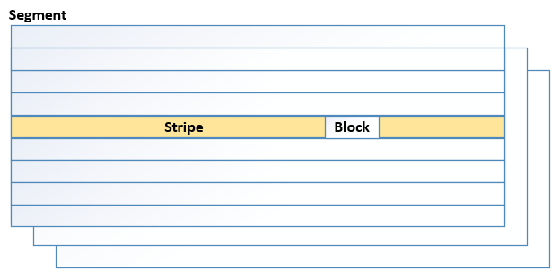
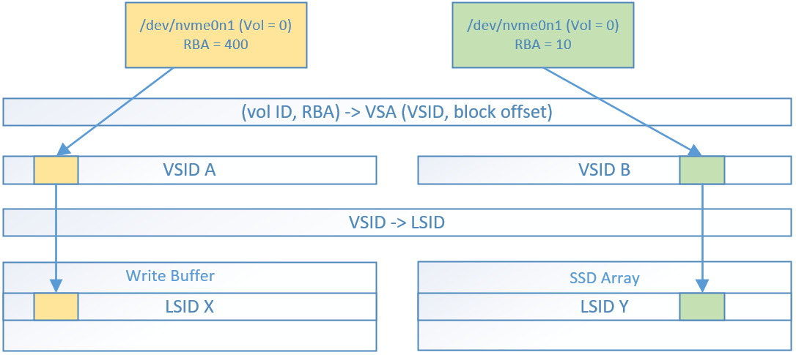
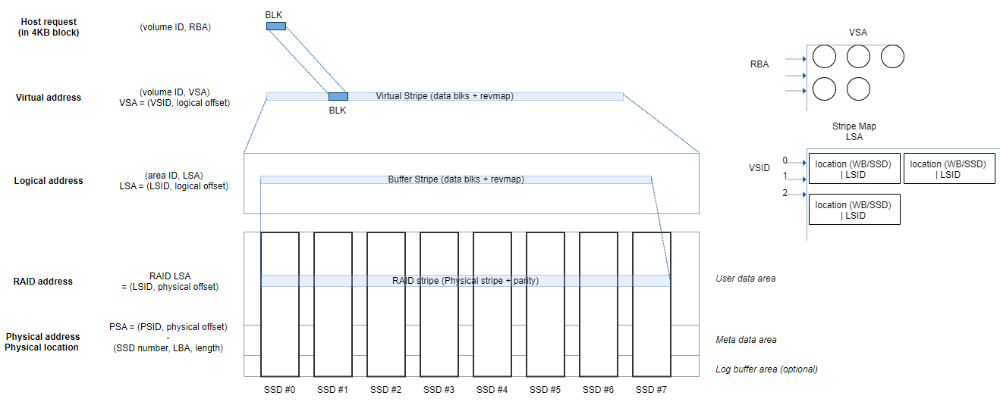
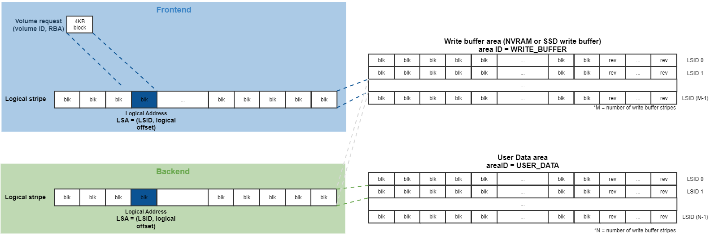

- [Introduction](#introduction)
- [Terminology](#terminology)
- [Level Mapping Scheme](#level-mapping-scheme)
- [Area](#area)

# Introduction
The mapper module internally manages the addresses of blocks used by hosts as virtual addresses and logical addresses, implements network storage and log structured storage, which are characteristics of POS, and optimizes SSD (NAND) performance.
The main purpose is to manage the mapping table from the host user I/O request (RBA) to the virtual address and logical address of the two stages in units of 4KB mapping.
Through the virtual address, blocks can be grouped into stripe units (VSA) for each of the N volumes (volume ID) configured by the user.
The logical address represents the space in which the virtual address is written in the actual write buffer region or user data region.

# Terminology

1. **RBA**: Requested Block Address. The 4KB-sized block address used by the host system.

2. **VSA**: Virtual Stripe Address. Block address in virtual stripe.

3. **VSID**: Virtual stripe ID.

4. **LSA**: Logical Stripe Address. Block address in logical stripe.

5. **LSID**: Logical Stripe ID.

6. **Write Buffer**: It is a buffer space for write operation in stripe unit that stays before stripe is flushed to SSD.

7. **User Data Region**: Area where user data is stored in SSD array. The RAID level configured from POS configuration is applied.

8. **Meta Data Region**: Area where meta data is stored in SSD array.

9. **Write Buffer Stripe**: The Stripe stored in the write buffer.

10. **Data Stripe**: The Stripe stored in the user data region.

# Level Mapping Scheme
In the POS, all write data is written in the write buffer area, and flush it to the user data region to maximize parallelism of the SSD array.
In this process, the location of the data is determined by the stripe, and all user blocks in the POS represent the stripe to which the block belongs and the offset in the stripe.

POS uses two-level mapping techniques: block mapping, which converts the block requested by the host into a virtual address, and VSID to LSID stripe mapping, which indicates where the virtual address is stored.

The POS processes the host I/O request in units of RBA, which is mapped within the virtual stripe. (virtual address)
The virtual address has an address space for each volume and is represented as volume ID and VSA to specify the location of the requested RBA.
The VSA consists of VSID and logical offset in stripe.
The logical address refers to the address where the data is actually written, and consists of a factor indicating the media area where the data is written, and an area ID and LSA to represent the location within the area.
Area ID refers to the ID of the area where the data is stored and can be a write buffer or user data area.
The LSA consists of the LSID, which is a stripe offset in the area, and the logical offset, which is a block offset in the stripe.
This logical offset is the same as the logical offset value of the VSA.

The mapper converts the virtual address into a logical address according to the event type registered in each event handler.
Converting a logical address to a physical address and location, which are actual device addresses, is not included in the role of the mapper.
All mapping tables are stored as metadata areas through the metafile system layer.

## Area
The host request is stored in write buffer or user data region, the logical stripe structure for each region is as follows.

