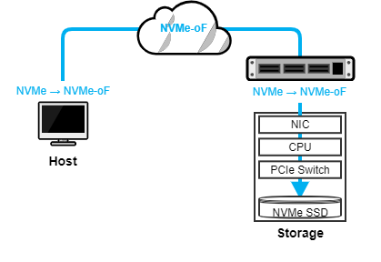
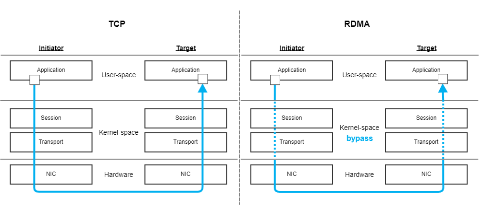
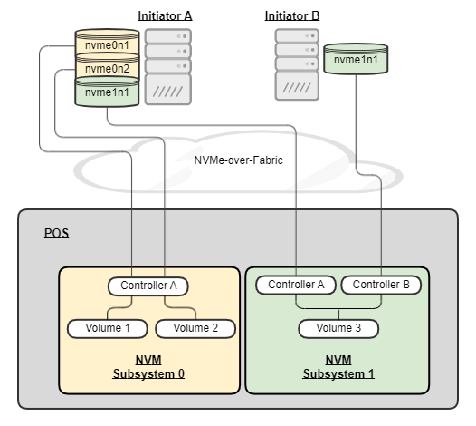

# NVMe-over-Fabrics (NVMe-oF) Interface
## Why New Interface?
NVMe-oF has emerged to break through the scaling limitations of PCIe-attached NVMe. NVMe-oF allows storage applications to talk to remote NVMe devices over network and consequently unblocks those applications from the physical limitation on the number of PCIe lanes a single host can have. NVMe-oF performs encapsulation/decapsulation at each layer of the software stack to maintain end-to-end NVMe semantics across a range of topology. The following illustrates how an NVMe command travels from client (hosts) to server SSDs through NVMe-oF protocol.

## Network Transport (TCP vs. RDMA)
The network fabric used for NVMe-oF can be several types (i.e., Fibre Channel, RDMA, and TCP) according to the current NVMe-oF 1.1 Specification.  POS currently supports TCP and RDMA (RoCE v2). We should be aware of pros and cons of each transport type, so that we could make the best decision under various constraints. 

**TCP transport** relies on commodity network hardware including switches, Ethernet NICs, and cables. Datacenter can utilize their existing TCP network with NVMe/TCP. Operating TCP network infrastructure is relatively cheaper and also has wider community support. However, we can't avoid going through kernel stack that uses TCP sockets and handling network interrupts, which could affect the latency of an I/O request, significantly. TCP transport also generally requires more CPU resources than RDMA does.

**RDMA transport** offloads the entire network processing stack to its custom hardware and saves host CPU cycles to process packets. It can also achieve extremely low latency by bypassing the kernel stack, resulting in better performance. On the other hand, the cost of RDMA-specific switches, NICs, and cables is known to be more expensive than TCP-based commodity hardwares because RDMA relies on a lossless network. 

The following figure illustrates the network I/O path of TCP and RDMA. The major difference is whether Kernel Space is involved in I/O or not. As described before, a TCP packet goes through Kernel Space with multiple context switches, while RDMA packet bypasses the intermediate layers and directly gets to the User Space.

## POS as an NVMe-oF Target

PSD (PoSeiDon) server is a (Samsung & Inspur)-engineered storage server that runs POS. POS enables initiator to access PSD server (specifically, NVM subsystem) as if it is a single or multiple local block device(s), while in reality the device is remotely mapped to multiple physical NVMe SSDs on PSD server. POS internally manages a pool of NVMe SSDs called POS array to construct volume(s) and expose the devices as a namespace to the initiator side in accordance with NVMe-oF specification. 

The following network diagram shows how PSD server can be networked to support multiple initiators and NVM subsystems. PSD server instantiates two NVM subsystems, where the first one (called "0") is assigned with a single controller (called "A") and the second one (called "1") has two controllers (called "A" and "B"). As in the example, an NVMe-oF block device on the Initiator side is always mapped to a single POS volume on the target side, while a single POS volume can be connected by multiple controllers and initiators. The types of available network transport currently are TCP and RDMA (RoCE v2). In addition to the user I/O path, there is a separate network path that allows a system administrator to perform storage provisioning, monitoring, troubleshooting, testing, and etc. This management network is only accessible locally through Unix Domain Socket.

