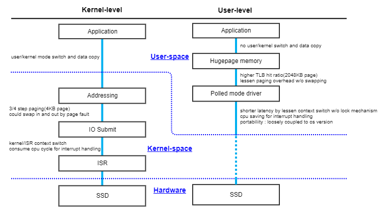
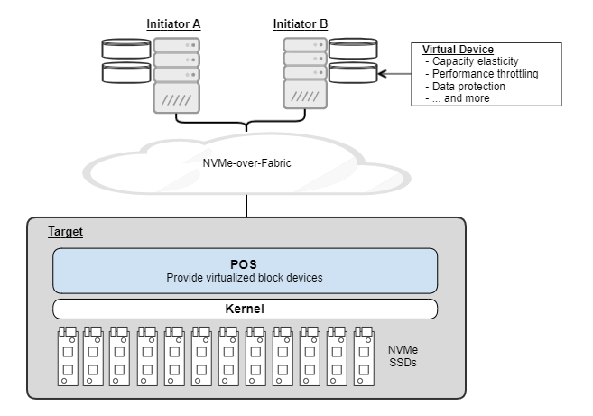

# What is Poseidon OS (POS)?
Poseidon OS (POS) is a light-weight storage OS that offers the best performance and valuable features over storage network. POS exploits the benefit of NVMe SSDs by optimizing storage stack and leveraging the state-of-the-art high speed interface. Also, it implements software-defined storage capabilities to meet the various needs of storage applications in a data center. With POS, industries can easily build Composable Disaggregated Infrastructure in their data centers. The latest version of POS is 0.9.2 and released at https://github.com/poseidonos/poseidonos.

The key characteristics of POS are as follows: 

**Highly optimized for low-latency & high-throughput NVMe devices**

The performance characteristics of an NVMe device differ a lot from those of other types of devices (e.g., SATA HDD/SSD, ...) and break assumptions in a traditional storage stack. For example, the traditional I/O path based on interrupt and soft IRQ could suffer from the context switch overhead, which used to work efficiently for disk-based storage system. To fully exploit the benefit of using fast storage devices, POS implements highly optimized I/O path with minimum software overhead and maximum parallelism. 

**Supporting NVMe-over-Fabrics interface over RDMA and TCP**

POS is capable of exposing block devices over network. This helps cloud vendors to separate their applications from the physical topology of storage devices. By avoiding tight coupling between compute and storage resources, the vendors should be able to deploy and balance their application workloads more flexibly. 

**Running as user-level application (vs. kernel-level)**

One of the key design decisions is to run POS as user-level application. The rationale behind it is to fully control the I/O path and avoid wasting CPU cycles required by general-purpose OS activities. The following figure illustrates what types of software overheads exist in Kernel Device Driver (KDD) and how they could be eliminated in User Device Driver (UDD).

**Virtualizing storage resources**

POS offers virtualized block devices that provide valuable features as well as block read/write functionality: capacity elasticity, performance throttling, data protection (RAID), and more. Customers could benefit from the features for free transparently. The following figure illustrates how POS (represented as "Reference Software") plays a role in storage virtualization. POS sits between initiator(s) and NVMe device(s) and remaps, duplicates, and/or buffers I/O requests to implement the features.

