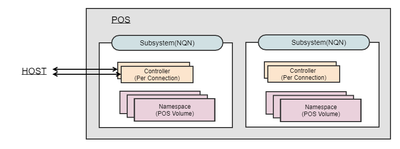
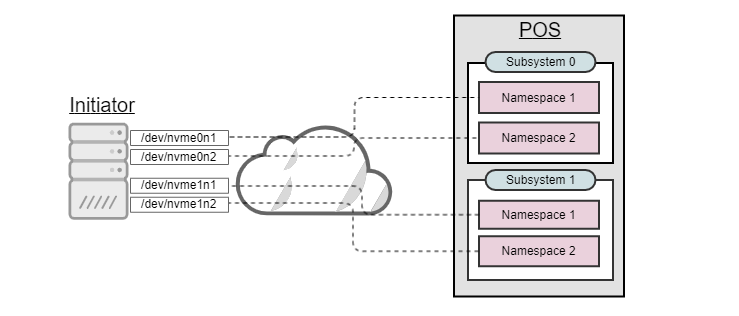

# Volumes
## What Is POS Volume?
POS volume is storage resource visible as a block device to a client host. Internally, POS volume is an NVM namespace and attached to one of the NVM subsystems on a target. When POS volume is mounted, the corresponding NVM namespace allows incoming connection and is accessible to initiator(s). When the connection is established, NVM subsystem creates a new controller, from which point the initiator can send/receive block requests over the connection. This process is illustrated in the following figure.



Here are a few constraints on the relationship among the components:

- POS volume cannot be shared by multiple NVM namespaces. 
- NVM controller is associated with one host at a time.

The following figure elaborates more on how block devices on an initiator are mapped to NVM namespaces on a target. The target is exposing two NVM namespaces from NVM subsystem 0 and another two from NVM subsystem 1. Each NVM namespace is called as POS volume and abstracted as a block device on the initiator. The naming convention of a standard NVMe-oF block device is, /dev/nvme{subsystem number}n{namespace number}. For example, /dev/nvme1n1 will be mapped to (NVM subsystem 1, NVM namespace 1) on a target. 



```bash
Node             SN                   Model                                    Namespace Usage                      Format           FW Rev
---------------- -------------------- ---------------------------------------- --------- -------------------------- ---------------- --------
/dev/nvme0n1     IBOF00000000000001   IBOF_VOLUME_EXTENTION                    1           2.15  GB /   2.15  GB    512   B +  0 B   19.10
/dev/nvme0n2     IBOF00000000000001   IBOF_VOLUME_EXTENTION                    2           2.15  GB /   2.15  GB    512   B +  0 B   19.10
/dev/nvme1n1     IBOF00000000000002   IBOF_VOLUME_EXTENTION                    1           2.15  GB /   2.15  GB    512   B +  0 B   19.10
/dev/nvme1n2     IBOF00000000000002   IBOF_VOLUME_EXTENTION                    2           2.15  GB /   2.15  GB    512   B +  0 B   19.10
```

## Constraints on POS Volume Creation
POS validates user-supplied inputs when creating POS volume. The properties of POS volume must satisfy the following constraints:

- The size must be multiples of 1 MB.
- The minimum size is 1 MB. 
- The maximum size can be as large as the free space of POS array. 
- The size can be specified in units of Byte, Mega Byte, Giga Byte.
- The length of a volume name must be between 2 and 255 (inclusive). 
- Any whitespace(s) in the front or the end of a volume name is trimmed. 
- Only the following character set is allowed for a volume name: [a-zA-Z0-9_-]
- The volume name must be unique within POS array.
- The maximum number of POS volumes is limited to 256 for a single POS array.
- POS array must be in "NORMAL" (i.e., successfully mounted) or "BUSY" state to be able to create new POS volume.

## Constraints on Throttling POS Volume Performance
Storage administrator can choose to set performance limit on per-volume basis. The maximum bandwidth (BW) or IOPS value can be provided during volume creation or configured dynamically afterwards. This configuration affects both read/write performance of a volume. 

POS validates the configuration and uses it only when they are within an expected range. Otherwise, POS may cut it down or pick up a smaller one. Here are a few contracts and constraints: 

- If the sum of (BW, IOPS) pairs from all POS volumes exceeds the capacity of POS performance, POS chooses a smaller value than what is provided by a user.
- If both IOPS and BW are set, POS chooses whichever is satisfied first for throttling. 
- BW must be between 10 ~ 17592186044415(UINT64_MAX / 1024 / 1024) and in the unit of MiB.
- If BW is null (not given) or 0, POS will not impose any BW limit on a volume.
- IOPS must be between 10 ~ 18446744073709551(UINT64_MAX / 1000) and in the unit of KIOPS.
- If IOPS is null (not given) or 0, POS will not impose any IOPS limit on a volume.
- POS array must be in "NORMAL" (i.e., successfully mounted) or "BUSY" state to be able to configure a volume with (BW, IOPS).

## Mounting POS Volume
"Mount" operation establishes NVMe-oF connection between an initiator and a target. If storage administrator does not specify an NVM subsystem to attach POS volume to, POS chooses the next available NVM subsystem in a round-robin fashion. 

Restriction: A subsystem can only be associated with a single array, wheras an array can be associated with multiple subsystems. The association between an array and a subsystem is established when a volume of the array is first mounted to the subsystem. Once an association is established, the volumes of the other arrays cannot be mounted to that subsystem.


## Unmounting Volume
"Unmount" operation detaches POS volume from its corresponding NVM subsystem, stopping I/O requests between an initiator and a target.