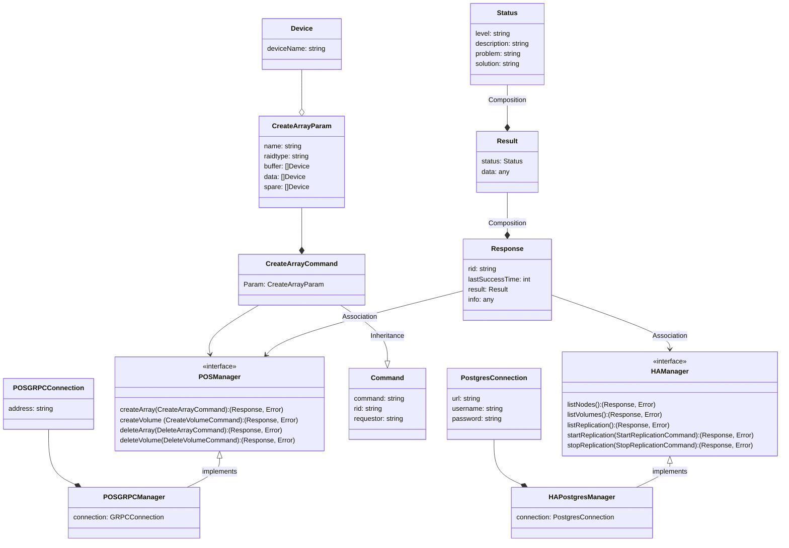

The above class diagram for Kuoros module shows how the Kuoros module will be structured.
The POSManager interface will have all the commands that can be executed on POS and HAManager will have all the commands that can be executed on HA DB.

The above class Diagram also represents the Command for CreateArray function.

For a client application, to use the Kuoros module, the following code should be used:
```
posConnector := POSGRPCManager{
    POSGRPCConnection{
        addres: "127.0.0.1"
    }
}

createArrayCommand := CreateArrayCommand{
    Param: {
        name: "POSArray",
        raidtype: "RAID0",
        buffer: []Device{
            Device{
                deviceName: "uram0"
            }
        }
        data: []Device{
            Device{
                deviceName: "unvme-ns-0"
            }
        }
        spare: []Device{
            Device{
                deviceName: "unvme-ns-1"
            }
        }
    }
}

res, err := posConnector.CreateArray(createArrayCommand)
```

Similarly user can create an object for HAManager and use it to call HA commands

For Adding a new POS function, the following steps need to be done:
1. Command structure need to be defined similar to CreateArrayCommand 
2. Add the function signature to POSManager
3. Implement the function in POSGRPCManager

