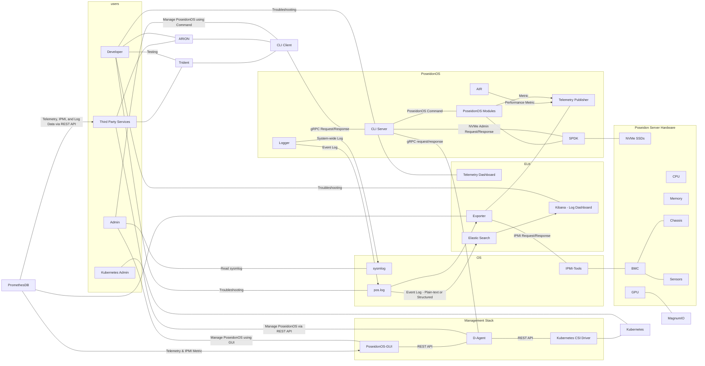

This document contains the design of the management architecture for PoseidonOS.

```mermaid
graph LR

    subgraph users
    Admin
    Developer
    K8SAdmin[Kubernetes Admin]
    3rdParty[Third Party Services]
    end

    Admin --- |Manage PoseidonOS using Command| CliClient
    Admin --- |Read sysmlog| syslog
    Admin --- |Manage PoseidonOS using GUI| PosGUI
    K8SAdmin --- K8S
    Developer --- |Troubleshooting| TelemetryDashboard
    Developer --- |Troubleshooting| Kibana
    Developer --- |Troubleshooting| pos.log
    Developer --- ARION
    Developer --- |Testing| Trident
    3rdParty --- |Manage PoseidonOS via REST API| DAgent
    3rdParty --- ARION
    3rdParty --- Trident
    Prom --> |Telemetry, IPMI, and Log Data via REST API| 3rdParty


    K8S[Kubernetes]
    CliClient[CLI Client]
    Prom[PromethesDB]
    Prom --- Exporter      
    
    
    subgraph ARION
    end
    
    
    
    subgraph Trident
    end

    ARION --- CliClient
    Trident --- CliClient
    CliClient --- |gRPC Request/Response| CliServer
    Exporter --- Telemetry
    Exporter --- |IPMI Request/Response| IPMI
    Prom --> |Telemetry & IPMI Metric| PosGUI
    pos.log --> Exporter


    subgraph ELK
    Kibana[Kibana - Log Dashboard]
    ElasticSearch[Elastic Search]
    TelemetryDashboard[Telemetry Dashboard]
    ElasticSearch --> Kibana
    Exporter[Exporter]
    end

    pos.log --> |Event Log - Plain-text or Structured| ElasticSearch


    subgraph M9K[Management Stack]
    DAgent[D-Agent]
    K8SDriver[Kubernetes CSI Driver]
    PosGUI[PoseidonOS-GUI]

    DAgent --- |REST API| K8SDriver
    PosGUI --- |REST API| DAgent
    end

    CliServer --- |gRPC request/response| DAgent
    K8SDriver --- K8S


    subgraph PoseidonOS
    Air[AIR]
    CliServer[CLI Server]
    Telemetry[Telemetry Publisher]
    PosModule[PoseidonOS Modules]
    SPDK[SPDK]
    Logger[Logger]
    CliServer --- |NVMe Admin Request/Response| SPDK
    CliServer --- |PoseidonOS Command| PosModule
    PosModule --> |Metric| Telemetry
    PosModule --- SPDK
    Air --> |Performance Metric| Telemetry
    end

    SPDK --- SSDs
    Logger --> |Event Log| pos.log
    Logger --> |System-wide Log| syslog


    subgraph Pos[Poseidon Server Hardware]
    SSDs[NVMe SSDs]
    BMC[BMC]
    CPU
    Memory
    Chassis
    Sensors
    GPU
    BMC --- Chassis
    BMC --- Sensors
    end


    subgraph OS
    IPMI[IPMI-Tools]
    pos.log[pos.log]
    syslog[sysmlog]
    end
    IPMI --- BMC
    GPU --- MagnumIO

```