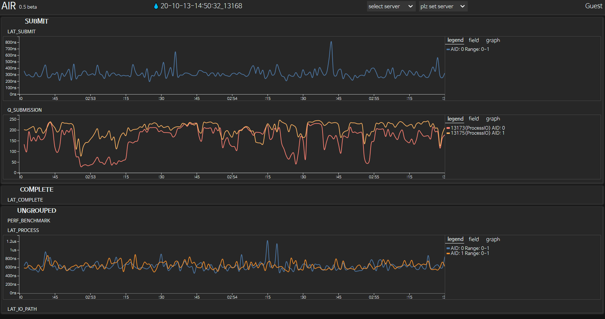
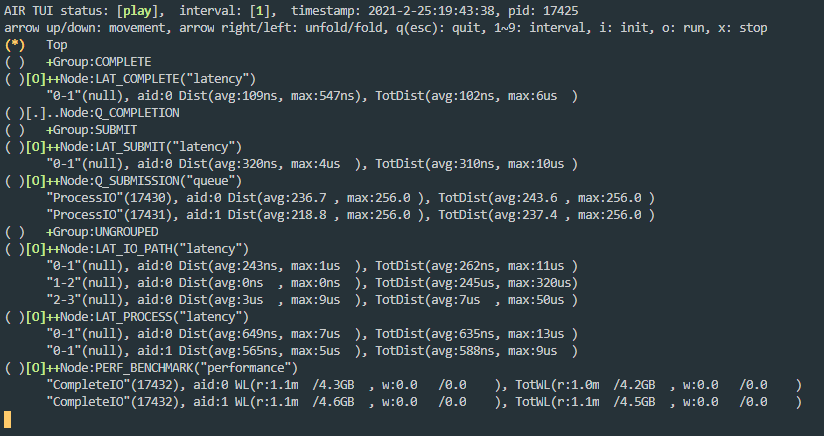

# AIR User Guide 0.5.x-beta


## 1. Overview

### 1.1. Objectives

**The Analytics In Real-time (AIR)** provides a set of APIs for profiling performance, latency, resource, and so on. It achieves run-time manipulation by designing all of the modules into event-driven and operating in a single dynamic chain, which optimizes collected data processing and minimizes profiling overhead.
The AIR currently supports:

- Performance Profiling
- Latency Profiling
- Queue Profiling


### 1.2. Terminology & Acronyms

| Terms   | Terminology & Acronyms                    |
| ------- | ----------------------------------------- |
| iBoF    | Intelligent Bunch of Flash                |
| iBoF OS | Samsung proprietary Storage Management OS |
| AIR     | iBoF Profiler, Analytics In Real-time     |
| CLI     | Command Line Interface                    |
| TUI     | Text-based User Interface                 |
| GUI     | Graphical User Interface                  |

<br>

## 2. Build 

### 2.1. Source Code

**[AIR Stand Alone]** <br>
`git URL: http://10.227.30.174:7990/scm/ibof/ibofprofiling.git `

<br>

**[AIR with iBoF OS]** <br>
`git URL: http://10.227.30.174:7990/scm/ibof/ibofos.git`

<br>

**[AIR GUI Client]** <br>
`git URL: http://10.227.30.174:7990/scm/ibof/airclient.git`

<br>

**[AIR GUI Server]** <br>
`git URL: http://10.227.30.174:7990/scm/ibof/airserver.git`

<br>

### 2.2. AIR Static Library (Stand Alone)

#### 2.2.1. Configuration

Before build the AIR, configuration setting should be the first.

* **Set Configuration**

``` bash
# From ibofprofiling root directory
$ cd lib/air/config
$ vim air.cfg
```

|         | Mandatory                    | Optaional |
| ------- | ----------------------------------------- | ----------- |
| DEFAULT    | StreamingInterval, AirBuild, NodeBuild, NodeRun, SamplingRatio, AidSize | - |
| GROUP | GroupName	 | NodeBuild, NodeRun, SamplingRatio |
| NODE     | NodeName, Type, GroupName    | NodeBuild, NodeRun, SamplingRatio |

**[DEFAULT]**  <br>
&nbsp;&nbsp;The global configurations such as StreamingInterval, AirBuild, and AidSize and the default value of node configurations such as NodeBuild, NodeRun, and SamplingRatio are set here. <br>

**[GROUP]** <br> 
&nbsp;&nbsp;Set of Nodes. More than one node can be included. There is no limitation of the number of nodes.

**[NODE]** <br> 
&nbsp;&nbsp;Each config entry indicates each log point's name, type, and availability. Each entry has to start and end with double quotation marks(""). 

&nbsp;&nbsp;`StreamingInterval:` StreamingInterval configuration indicates how frequently write profiling data to the json file. The default value is set to 1. It means profiling data is written at the tail of the air_result.json in every second. The basic unit of the streaming_interval is in seconds.

&nbsp;&nbsp;`AirBuild:` AirBuild configuration determines whether the application will be built with AIR or not.

&nbsp;&nbsp;`AidSize:` AidSize configuration determines allowable maximum aid size.

&nbsp;&nbsp;`NodeName:` NodeName means the designated logging id.
<br> &nbsp;&nbsp;&nbsp;&nbsp;&nbsp;&nbsp;※ The length of the name value must not exceed 18 characters.

&nbsp;&nbsp;`Type:` Type configuration means the data type(PERFORMANCE, LATENCY, and QUEUE) to be profiled

&nbsp;&nbsp;`NodeRun:` NodeRun configuration means that node can collect data initially or not. <br>
&nbsp;&nbsp;&nbsp;&nbsp;&nbsp;&nbsp;(Run -> On, Do not run -> Off)

&nbsp;&nbsp;`SamplingRatio:` SamplingRatio determines how often to collect stochastic type(Queue) data.

&nbsp;&nbsp;`GroupName:`  GroupName in NODE refers to the group containing the corresponding node. 

&nbsp;&nbsp;`GroupName:` GroupName configuration indicates the name of set of nodes.


``` bash
R"AIR(    // do not change this format!!

[DEFAULT]    // default setting for Mandatory
        "StreamingInterval:1, AirBuild:True, NodeBuild:True, NodeRun:On, SamplingRatio: 1000, AidSize : 32"
[/DEFAULT]

[GROUP]    // group setting for Mandatory & Optional

[/GROUP]

[NODE]    // node setting for Mandatory & Optional
        "NodeName: PERF_BENCHMARK, Type: PERFORMANCE"
        "NodeName: LAT_SUBMIT, Type: LATENCY"
        "NodeName: LAT_PROCESS, Type: LATENCY"
        "NodeName: LAT_COMPLETE, Type: LATENCY"
        "NodeName: LAT_IO_PATH, Type: LATENCY"
        "NodeName: Q_SUBMISSION, Type: QUEUE"
        "NodeName: Q_COMPLETION, Type: QUEUE"
[/NODE]

[WEB]
        "NodeType: PERFORMANCE,  Type: GRAPH,  Mode: GENERAL,  Graph: LINE,  Item: [iops_read]"
        "NodeType: LATENCY,      Type: GRAPH,  Mode: GENERAL,  Graph: LINE,  Item: [mean]"
        "NodeType: QUEUE,        Type: GRAPH,  Mode: GENERAL,  Graph: LINE,  Item: [depth_period_avg]"
[/WEB]

)AIR"

```

<br>

#### 2.2.2. Build

``` bash
# From AIR main directory
$ make (optional target) (optional cfg=config_file_name)
Just make includes default target(release) and default config file(config/air.cfg)
When build AIR, user can select one of the air config file in config folder with cfg option.
```

<br>

#### 2.2.3. Library

``` bash
# From AIR main directory
$ cd lib/air/lib
$ libair.a
```

<br>

### 2.3. AIR with iBoF OS

The build sequence is as follows:

1. build AIR 
2. build SPDK
3. build iBoFOS

The build shell is in the file `"ibofos_root_dir/lib/build_ibof_lib.sh"`. When you try to run like this `"./build_ibof_lib.sh all"`, 1 & 2 build sequence will be done. After it succeed, you can build iBoFOS as usual. The usecase AIR with iBoFOS is handled in AIR Tutorial.

<br>

## 3. API

There are two types of APIs, the one is functions for preparing the profiling and the other is data collecting functions. To use the AIR APIs it is needed that including `"air.h"`.

### 3.1. Preparing Functions

| API                                  | Description                             |
| ------------------------------------ | --------------------------------------- |
| AIR_INITIALIZE(uint32_t cpu_num = 0) | Initialize the AIR instances            |
| AIR_ACTIVATE()                       | The AIR starts profiling                |
| AIR_DEACTIVE()                       | Join the AIR thread to the applications |
| AIR_FINALIZE()                       | Destroy the AIR instances               |

**Example** 

``` c++
...
#include "air.h"
...
int main(void)
{
	...
    AIR_INITIALIZE(0);
    // AIR_INITIALIZE();
    // This also can be used and air is running on cpu 0. 
    AIR_ACTIVATE();
    
    /*  do work  */
    
    AIR_DEACTIVATE();
    AIR_FINALIZE();
    
    return 0;
}
```

<br>

### 3.2. Data Collecting Functions

 Each log point has target and logger type. To use AIR, you have to specify target and logger type in code directly. After then, you can insert user APIs in your codes to profile your application. 

#### 3.2.1. Target & Logger Type

**[Performance Target]**  <br>Performance target measures read and write of IOPS and bandwidth.

+ Read IOPS / Bandwidth
+ Write IOPS / Bandwidth
+ Total IOPS / Bandwidth
+ Average IOPS / Bandwidth


**[Latency Target]** <br>Latency target measures for getting latency of specific sections between function calls.

+ Mean latency
+ Min latency
+ Max latency
+ Quartile latency
+ Tail latencies
+ Standard deviation


**[Queue Target]** <br>Queue target measures queue size and depth.

+ Queue size
+ Queue depth average
+ Queue depth partial max (interval)
+ Queue depth total max


**[Repetitive Logger]** <br>Repetitive logger is full logger. It collects all logging data. This includes performance and latency type.

<br>

**[Stochastic Logger]** <br>Stochastic logger samples target data probabilistically. You can adjust sampling rate by cli command within the range of 1 to 10000. Default sampling rate is 1000 and it means that it collects one logging data every a thousand logging data (Sampling rate 1000 means sampling with a probability of 1/1000).this includes queue type.

<br>

#### 3.2.2. API

The API logs the information at the current time. Add API where you want to measure the data at that time.

<br>

#### 3.2.2.1. Performance Log Point

Add performance log point in your application code area where I/O occurs. 

**[Prototype]**

``` c++
AIRLOG(string node_name, uint32_t aid, uint32_t io_type, uint32_t io_size)
```

**[Prameter]**

| Parameter | Description                                                  |
| --------- | ------------------------------------------------------------ |
| node_name | String type value called node_name. It indicates the log point. |
| aid       | unsigned integer. user defined identifier. (e.g. volume_id)  |
| io_type   | This value indicates following io_size is read IO size or write. The value of the io_type is unsigned int type. It is predefined inside AIR library. |
| io_size   | Integer. It indicates I/O size of log point and its unit is byte. AIR counts only the aligned I/O size and its sizes are 512B, 1KB, 2KB, 4KB, …, 128KB and 256KB. For the remaining I/O, it is counted as I/O greater than 256KB or no aligned I/O. |

**[Example]**

``` c++
AIRLOG("PERF_IOWorker", 0, air::WRITE, ubio->size);
/* Do Write */
     …
AIRLOG("PERF_IOWorker", 0, air::READ, ubio->size);
/* Do Read */
```

<br>

#### 3.2.2.3. Latency Log Point

This API gets latency information between logging points of the specific path. Insert the API on code where you measure the latency breakdown. Note that this API can be inserted inter-threads or inter-functions.

**[Prototype]**

``` c++
AIRLOG(String node_name, uint32_t aid, uint32_t seq_index, uint32_t key)
```

**[Parameter]**

| Parameter | Description                                                  |
| --------- | ------------------------------------------------------------ |
| node_name | String type value called node_name. It indicates the log point. |
| aid       | unsigned integer. user defined identifier. (e.g. volume_id)  |
| seq_index | Index of logging point.                                      |
| key       | Unsigned integer. Unique key. AIR can tell logging sequence refer to this value. |

**[Example]**

``` c++
AIRLOG("AsyncIO_Read", 0, 0, ubio->address);
AIRLOG("AsyncIO_Write", 0, 0, ubio->address);
…
If (READ)
{
AIRLOG("AsyncIO_Read", 0, 1, ubio->address); 
/* Do Read */
}
else
{
AIRLOG("AsyncIO_Write", 0, 1, ubio->address);
/* Do Write */
}
…
AIRLOG("AsyncIO_Read", 0, 2, ubio->address);
AIRLOG("AsyncIO_Write", 0, 2, ubio->address);

/*
    2 Paths of latency break down
    read:  0 -> 1 -> 2
    write: 0 -> 1 -> 2
*/
```

<br>

#### 3.2.2.4. Queue Log Point

 Add queue log point in your application code area where you measure queue.

**[Prototype]**

``` c++
AIRLOG(String node_name, uint32_t aid, uint32_t q_depth, uint32_t q_size)
```

**[Parameter]**

| Parameter | Description                                                  |
| --------- | ------------------------------------------------------------ |
| node_name | String type value called node_name. It indicates the log point. |
| aid       | Unsigned integer. User defined identifier. (e.g. volume_id)  |
| q_depth   | Unsigned integer. Depth of queue to be sampled.              |
| q_size    | Unsigned integer. Size of queue to be sampled.               |

**[Example]**

``` c++
AIRLOG("Q_IOWorker", 1, queue.depth(), queue.size());
/* Do Enqueue or Dequeue */
```

<br>

### 3.3. SPDK Support

From AIR 0.2.0-alpha, AIR can profile SPDK source code. Since SPDK is based on C, the C wrapping APIs operating only in C based code are used. The usage is same as described above. The one thing difference is the API function name, just attach _C behind API like AIRLOG_PERF_C(). And these APIs are declared in header file `"air.h"`. 

| C Wrapping APIs                         |
| --------------------------------------- |
| AIR_INITIALIZE(cfg_file, cpu_num)     |
| AIR_ACTIVATE()                        |
| AIR_DEACTIVATE()                      |
| AIR_FINALIZE()                        |
| AIRLOG(nid, aid, type, size)     |

<br>

## 4 GUI

### 4.1 Install & Run AIR Daemon

```bash
# cd ibofos_root_dir/lib/air/script
# ./install_daemon.sh
# service aird start
# service aird status
```

<br>

### 4.2. Web Dashboard

User can access to GUI through web-browser such as Firefox at their own OA PC: `"http://10.1.2.2` or `"http://air.io"`. And user also has to set the proxy: `12.36.76.108:3128`.

* **File Control Panel** <br>
  The file control panel is on the top of the browser. <br>
  * **Select Server** <br> 
  Click a `select server` panel and  select the server ip. <br>
  * **Select Case** <Br> 
  Click the `case` panel named as start time and pid. The water icon is a case where profiling is completed. And the fire icon is a case where profiling is in progress. <br>

* **Control Panel** <br>
  The control panel on the left is activated when profilng is in progress. <br>
  The role of this panel is the same as that of an air cli. This can update the streaming interval and init/run/stop node(s). <br>

* **Data Panel** <br>
  The data panel plots graphs of profiling data in real time or in a replay manner. <br>
  * **Stop & Resume Button** <br>
  Click the graph, and `stop or resume icon` is activated. <br>
  * **Time Slice Bar** <br>
  Move the `red box` on the time slice bar to a certain time. <br> 
  * **Zoom in/out y-axis** <br>
  Move the cursor on the graph and `scroll` a mouse wheel. <br> 
  * **Zoom in/out x-axis** <br> 
  Move the cursor on the graph and press `"shift"` or `"z"` key and `scroll` a mouse wheel. <br> <br>



<br>

## 5. TUI

The AIR TUI(Text User Interface) is the visualization tool shows profiling results in text. The profiling results are shown according to the type of node in real-time. In every dump interval(default is 1 second), profiling result is updated. The profiling result of each node is thread-aware, also each thread breaks down to a specified user named AID. Resource profiling results are shown bottom of the normal data and detailed data page. 
This keys are basic commands of TUI. The detailed description is below.

| key  | Description                                                          |
| ---- | -------------------------------------------------------------------- |
| 1-9  | air_cli --air-stream-interval                                        |
| i    | air_cli --node-init (option value depends on cursor position)        |
| o    | air_cli --node-run=true_x (option value depends on cursor position)  |
| x    | air_cli --node-run=false_x (option value depends on cursor position) |
| q    | quit TUI                                                             |
| ↑,↓  | move cursor position                                                 |
| ←,→  | Fold or spread group/node data                                       |



## 6. CLI

The AIR command-line interface (CLI) is the software interface used to access your AIR profiler. The CLI provides a set of commands that you can use to monitor its operations and adjust the configuration as needed in run-time.

``` bash
# From AIR main directory
$ cd bin
$ ./air_cli --pid=<target_pid> [options] ...

```

### 6.1. Options

* ***--air-run=bool***

  Enable/Disable the air. Default is true.

  ex) ./air_cli --pid=<target_pid> --run=<true/false>

<br>

* ***--air-stream-interval=int***

  **`second`**                   Integer. Set interval second of dumping the logged data. Allow value range to be given, such as 1-30. Default is 3. 

<br>

* ***--node-run=bool_str:[int],[int]***

  By configuration, air will run according to the each trace point's specific option. User can enable one to multiple trace point by matching following options. 

  **`node:int`** 	           trace enum id 

  **`range:int,int`** 	trace enum id (first to last)

  **`group:int `**         	trace point's group id (if trace points are comprised of group)

  **`all`**		                  all trace point 

<br>

* ***--node-init=str:[int],[int]***

  By configuration, air will run according to the each trace point's specific option. User can initialize one to multiple trace point by matching following options. 

  **`node:int`** 	            trace enum id

  **`range:int,int`** 	 trace enum id (first to last)

  **`group:int`**	           trace point's group id (if trace points are comprised of group)

  **`all`**		                   all trace point

  <br>

* ***--node-sample-ratio=int_str:[int],[int]*** 

  **`ratio`**                       Integer. The following integer is 1/probability of sampling. Allow value range to be given, such as 1-10,000. Default is 1000.

  By configuration, air will run according to the each trace point's specific option. User can set sampling ratio one to multiple trace point by matching following options.

  **`node:int`** 	          trace enum id

  **`range:int,int`** 	 trace enum id (first to last)

  **`group:int`**	          trace point's group id (if trace points are comprised of group)

  **`all`**		                   all trace point

  ※ Only stochastic logger type tracer will be affected.

  <br>
